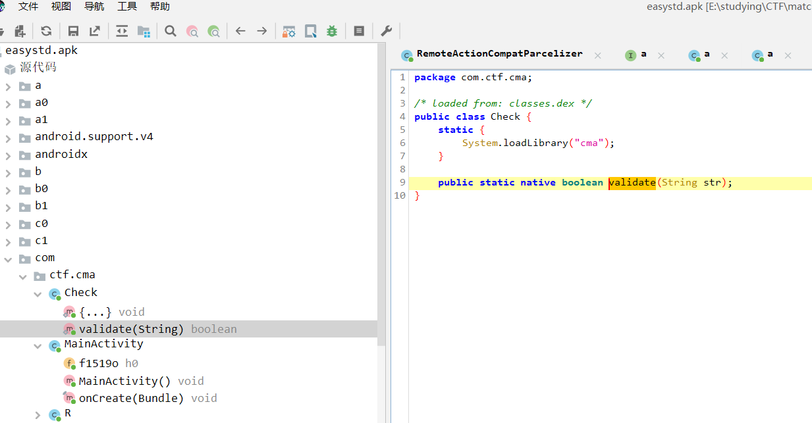
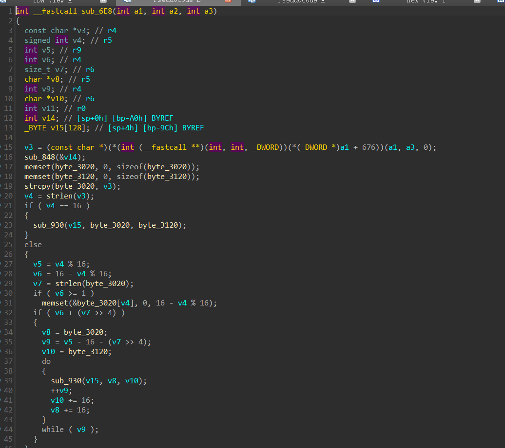

题目名称:reverse01

# 解题思路

安卓逆向，先jadx打开，可以发现发现加载了cmd

直接解包然后看arm
是个改了sbox的类似于sm4 / aes的东西



密钥的后半段被手动篡改了，拼接上即可
最后可以写好解密脚本就行

```python
import struct

S = [
    0xD1, 0x97, 0xEE, 0xF9, 0xCB, 0xE6, 0x3A, 0xB0, 0x11, 0xB1, 0x13, 0xC5, 0x2F, 0xFC, 0x2B, 0x02,
    0x2C, 0x60, 0x9D, 0x71, 0x2D, 0xB9, 0x03, 0xC4, 0xAD, 0x43, 0x14, 0x21, 0x4E, 0x81, 0x01, 0x9E,
    0x9B, 0x45, 0x57, 0xF3, 0x96, 0xE8, 0x9F, 0x7D, 0x34, 0x53, 0x0C, 0x44, 0xEA, 0xC8, 0xAB, 0x65,
    0xE3, 0xB4, 0x1B, 0xAE, 0xCE, 0x0F, 0xEF, 0x92, 0x87, 0xD8, 0x93, 0xFD, 0x72, 0x88, 0x38, 0xA1,
    0x40, 0x00, 0xA0, 0xFB, 0xF4, 0x74, 0x10, 0xBD, 0x84, 0x5E, 0x3B, 0x1E, 0xE1, 0x82, 0x48, 0xAF,
    0x6F, 0x6C, 0x86, 0xB5, 0x76, 0x63, 0xDD, 0x8C, 0xFF, 0xEC, 0x08, 0x4C, 0x77, 0x51, 0x9A, 0x32,
    0x19, 0x23, 0x09, 0x59, 0x64, 0x5F, 0xD6, 0xA5, 0x22, 0x25, 0x7B, 0x3C, 0x06, 0x26, 0x7F, 0x80,
    0xD3, 0x07, 0x41, 0x50, 0x98, 0xD4, 0x20, 0x55, 0x4B, 0x31, 0x05, 0xE0, 0xA7, 0xC3, 0xCF, 0x99,
    0xED, 0xB8, 0x8D, 0xD5, 0x47, 0xC0, 0x3F, 0xB2, 0xA4, 0xF0, 0xF5, 0xC9, 0xFE, 0x66, 0x12, 0xA6,
    0xE7, 0xA9, 0x5A, 0xA3, 0x9C, 0x33, 0x1D, 0x52, 0xAA, 0x94, 0x35, 0x37, 0xF2, 0x8B, 0xB6, 0xE4,
    0x1A, 0xF1, 0xE5, 0x29, 0x85, 0x61, 0xCD, 0x67, 0xC7, 0x2E, 0x24, 0xAC, 0x0A, 0x54, 0x49, 0x68,
    0xD2, 0xDC, 0x30, 0x42, 0xD9, 0xFA, 0x89, 0x28, 0x04, 0xF8, 0x6D, 0x75, 0x6A, 0x6B, 0x5C, 0x56,
    0x8A, 0x1C, 0xA8, 0x95, 0xBC, 0xDA, 0xBB, 0x78, 0x16, 0xDE, 0x5B, 0x46, 0x18, 0x17, 0x5D, 0xDF,
    0x0D, 0xC6, 0x36, 0x8F, 0xA2, 0xCA, 0x7C, 0xBA, 0x2A, 0x73, 0xD7, 0x15, 0xBF, 0xE2, 0xB3, 0xB7,
    0x8E, 0x6E, 0x90, 0x4D, 0x0B, 0x91, 0x70, 0x79, 0x62, 0xBE, 0xF6, 0x0E, 0xC2, 0x69, 0xC1, 0x83,
    0x1F, 0xF7, 0x7A, 0xEB, 0x3D, 0xDB, 0x4A, 0x27, 0x7E, 0xE9, 0x58, 0x39, 0xD0, 0xCC, 0x3E, 0x4F,
]

# 使用列表推导式替代循环
S = [s ^ 7 for s in S]

FK = (
    0xa3b1bac6, 0x56aa3350, 0x677d9197, 0xb27022dc,
)

CK = (
    0x00070e15, 0x1c232a31, 0x383f464d, 0x545b6269,
    0x70777e85, 0x8c939aa1, 0xa8afb6bd, 0xc4cbd2d9,
    0xe0e7eef5, 0xfc030a11, 0x181f262d, 0x343b4249,
    0x50575e65, 0x6c737a81, 0x888f969d, 0xa4abb2b9,
    0xc0c7ced5, 0xdce3eaf1, 0xf8ff060d, 0x141b2229,
    0x30373e45, 0x4c535a61, 0x686f767d, 0x848b9299,
    0xa0a7aeb5, 0xbcc3cad1, 0xd8dfe6ed, 0xf4fb0209,
    0x10171e25, 0x2c333a41, 0x484f565d, 0x646b7279,
)

def rotate_left(i32, k):
    return (i32 << k | i32 >> (32 - k)) & 0xffffffff

def tau(i32):
    return (S[i32 >> 24] << 24 | S[i32 >> 16 & 0xff] << 16 | 
            S[i32 >> 8 & 0xff] << 8 | S[i32 & 0xff])

def linear_substitution_0(i32):
    return i32 ^ rotate_left(i32, 2) ^ rotate_left(i32, 10) ^ rotate_left(i32, 18) ^ rotate_left(i32, 24)

def linear_substitution_1(i32):
    return i32 ^ rotate_left(i32, 13) ^ rotate_left(i32, 23)

def derive_keys(key):
    k0, k1, k2, k3 = struct.unpack(">IIII", key)
    k0 ^= FK[0]
    k1 ^= FK[1]
    k2 ^= FK[2]
    k3 ^= FK[3]

    for ck in CK:
        k0, k1, k2, k3 = (
            k0 ^ linear_substitution_0(k3) ^ ck,
            k1 ^ linear_substitution_1(k0),
            k2 ^ linear_substitution_0(k1),
            k3 ^ linear_substitution_1(k2),
        )
        yield struct.pack(">IIII", k0, k1, k2, k3)

s = SM4Key(b"A11223574689900Z")
cipher = bytes([0xBA, 0x26, 0xAF, 0xE9, 0x42, 0x0A, 0xFE, 0xB2, 0xA4, 0xB2, 0x6E, 0xCB, 0x45, 0x34, 0xD7, 0xAA, 0x69, 0x73, 0xC1, 0xA7, 0x47, 0xC7, 0xC7, 0xBB, 0xAB, 0x20, 0x76, 0x35, 0x5B, 0x0D, 0x57, 0x1C, 0x78, 0xE8, 0x4D, 0xB5, 0x4B, 0xC8, 0xC4, 0x81, 0xF7, 0x7E, 0xAB, 0xD5, 0x18, 0x80, 0xFA, 0xF1])
```


b'd5c44650-84cc-448d-a180-1b41a291f795\x00\x00\x00\x00\x00\x00\x00\x00\x00\x00\x00\x00'

得到的结果包上flag即可


